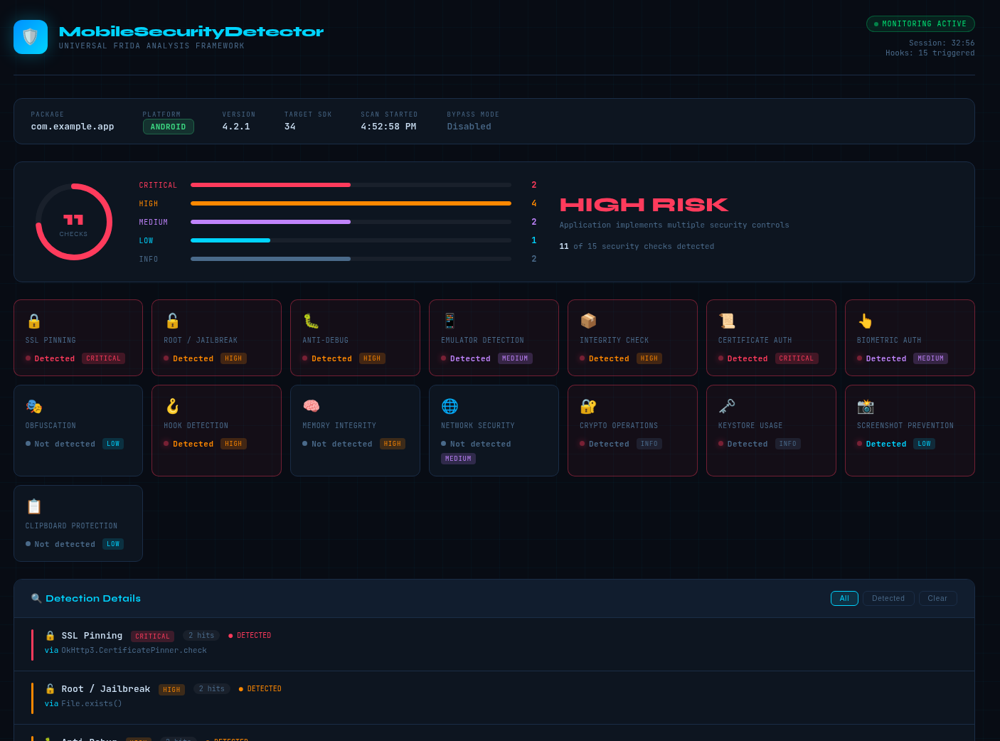

# MobileSecurityDetector

**MobileSecurityDetector** is a **universal Frida-based security analysis framework** designed to detect runtime security protections in Android and iOS applications.

It automatically hooks multiple security mechanisms used by modern mobile applications and produces both **terminal reports and a visual dashboard**.

This tool is useful for:

* Mobile security researchers
* Penetration testers
* Reverse engineers
* Bug bounty hunters
* Security auditors

# Features

The detector hooks **15 categories of mobile security protections** at runtime.

| Category                          | What It Detects                                            |
| --------------------------------- | ---------------------------------------------------------- |
| 🔒 **SSL Pinning**                | OkHttp3, TrustKit, NetworkSecurityConfig, WebView, Volley  |
| 🔓 **Root / Jailbreak Detection** | `su` binaries, Magisk, Cydia, filesystem checks            |
| 🐛 **Anti-Debug**                 | `Debug.isDebuggerConnected`, `ptrace`, `/proc/self/status` |
| 📱 **Emulator Detection**         | Android build props, TelephonyManager, IMEI checks         |
| 📦 **Integrity Checks**           | Package signatures, SafetyNet, Play Integrity API          |
| 📜 **Certificate Authentication** | mTLS / client certificates                                 |
| 👆 **Biometric Authentication**   | `BiometricPrompt`, `FingerprintManager`, `LAContext`       |
| 🪝 **Hook Detection**             | Frida / Xposed / Substrate detection                       |
| 🔐 **Cryptography Usage**         | `Cipher`, `SecretKeyFactory`, crypto algorithms            |
| 🗝 **Keystore Usage**             | AndroidKeyStore / iOS Keychain                             |
| 📸 **Screenshot Protection**      | `FLAG_SECURE`, `isCaptured`                                |
| 🎭 **Obfuscation Detection**      | `DexClassLoader`, reflection, dynamic loading              |
| 📋 **Clipboard Protection**       | Sensitive clipboard usage                                  |
| 🌐 **Network Security**           | TLS / certificate configuration                            |
| 💾 **Memory Integrity**           | Runtime tampering detection                                |

# Project Structure

This repository contains **three main components**.

## 1. universal_security_detector.js

The **Frida instrumentation script**.

It dynamically hooks multiple security APIs used by Android and iOS apps and detects runtime protections such as:

* SSL pinning
* root detection
* debugger detection
* emulator detection
* biometric authentication
* integrity checks

This script is the **core detection engine**.

## 2. security_detector.py

Python controller for the framework.

Features:

* Rich terminal dashboard
* Severity classification
* Hook monitoring
* Filtering capabilities
* JSON report export

Install dependencies:

```bash
pip install frida frida-tools rich
```

## 3. security_dashboard.html

A **visual web dashboard** for viewing the scan results.

Features:

* Interactive security cards
* Expandable detection details
* Risk classification
* Clickable detection methods
* Copy-ready Frida commands

# Dashboard Preview

Below is the **interactive dashboard interface** generated by the tool.



*(Place your image inside a folder named `docs` in your repo)*

Example structure:

```
repo/
 ├── universal_security_detector.js
 ├── security_detector.py
 ├── security_dashboard.html
 └── docs/
     └── dashboard.png
```

# Basic Usage

## Run Detection

Spawn the app and start monitoring:

```bash
frida -U -f com.target.app -l universal_security_detector.js --no-pause
```

---

## Attach to Running App

```bash
frida -U --attach-name com.target.app -l universal_security_detector.js
```

## Remote Frida Server

```bash
frida -H 127.0.0.1:27042 -f com.target.app -l universal_security_detector.js
```

# Using the Python Controller

Run detection with the enhanced terminal interface:

```bash
python3 security_detector.py -p com.target.app
```

Enable automatic bypass mode:

```bash
python3 security_detector.py -p com.target.app --bypass
```

Export the report:

```bash
python3 security_detector.py -p com.target.app -o report.json
```

# Example Output

The detector provides:

* Risk severity classification
* Number of security checks detected
* Detection methods used by the application
* Hook triggers
* Security control summary

# Example Detected Protections

```
SSL Pinning (CRITICAL)
via okhttp3.CertificatePinner.check

Root Detection (HIGH)
via File.exists()

Anti Debug (HIGH)
via Debug.isDebuggerConnected()

Hook Detection (HIGH)
via Frida detection routines
```

# Requirements

* Frida
* Python 3
* Android device / emulator
* Rooted device recommended for deeper analysis

Install Frida:

```bash
pip install frida-tools
```

# Disclaimer

This tool is intended **for security research and authorized penetration testing only**.

Do not use this tool against applications without proper authorization.

# Author

Created by **David Godbless Tenga**

Mobile Security Researcher | Penetration Tester | Reverse Engineer

If you want, I can also help you add **these advanced sections to make the repo more popular**:

* badges (stars, forks, license)
* installation guide
* animated GIF dashboard preview
* comparison with MobSF / Objection
* contribution guide
* star history graph

These **increase GitHub visibility and stars**.
